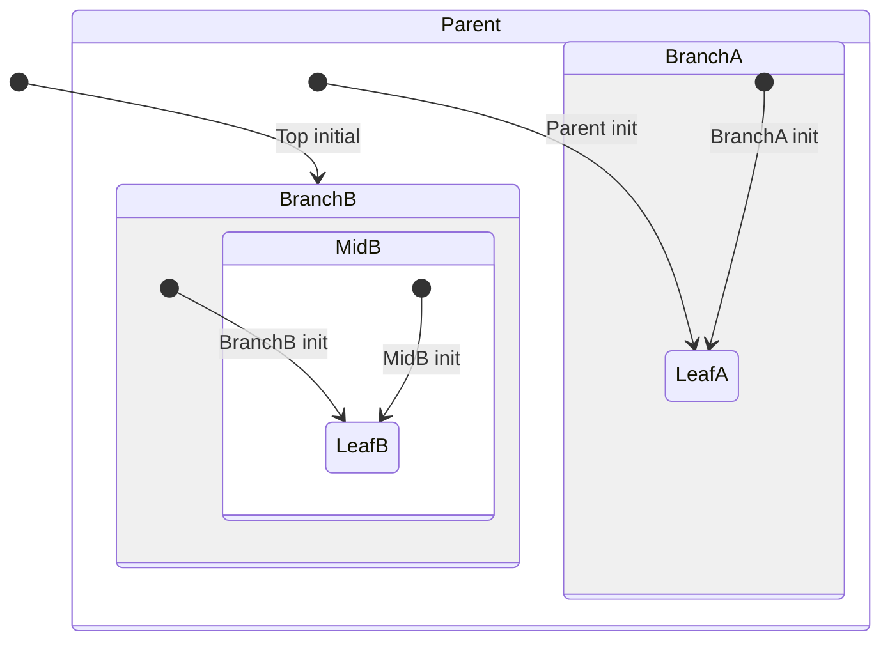

# sm_hsm

Lightweight hierarchical state machine (HSM) infrastructure for C, with an optional trace transport module aimed at embedded targets and simple host-side validation.

## Highlights

- **UML-style hierarchical states** with super-state fallback
- **Entry / exit / initial transitions** built into the core dispatch flow
- **Portable embedded design** via a small platform adaptation layer
- **Optional tracer** with fixed-block storage, ring queue, escaping, and checksum framing
- **Host-side example** under `test/` that demonstrates a nested statechart and can be compiled on a desktop toolchain

## Repository layout

```text
sm_hsm/
├── include/
│   ├── sm_assert.h   # Assertions and design-by-contract macros
│   ├── sm_hsm.h      # Core hierarchical state machine API
│   └── sm_tracer.h   # Optional tracer API
├── src/
│   ├── sm_hsm.c      # HSM engine implementation
│   └── sm_tracer.c   # Tracer implementation
├── test/
│   ├── include/
│   │   ├── bsp.h
│   │   └── smhsmtst.h
│   ├── ports/
│   │   ├── sm_port.h
│   │   └── smhsmtst_port.h
│   └── src/
│       ├── bsp.c
│       └── smhsmtst.c
├── LICENSE
└── README.md
```

## What is included

### 1. `SM_Hsm`: hierarchical state machine core

The core engine in `include/sm_hsm.h` and `src/sm_hsm.c` provides:

- a compact `SM_Hsm` runtime object with `curr` and `next` state pointers
- explicit state descriptors (`SM_HsmState`) containing:
  - `super`
  - `init_`
  - `entry_`
  - `exit_`
  - `handler_`
- initialization, dispatch, and transition support through:
  - `SM_Hsm_init_()`
  - `SM_Hsm_dispatch_()`
  - `SM_Hsm_transition_()`

State handlers return one of three outcomes:

- `SM_RET_HANDLED`
- `SM_RET_TRAN`
- `SM_RET_SUPER`

This lets a child state handle an event, request a transition, or delegate processing to its parent state.

### 2. `SM_Tracer`: optional framed trace output

The tracer in `include/sm_tracer.h` and `src/sm_tracer.c` is independent from the HSM core and provides:

- fixed-block memory pool allocation for trace records
- ring-buffer queuing of pending frames
- byte-oriented flush logic with escaping for `0x7E` and `0x7D`
- checksum generation and sequence numbering

The tracing macros are:

```c
SM_TRACE_BEGIN(rec_id, data_len);
SM_TRACE_PAYLOAD_BE(byte_value);
SM_TRACE_END(0);
```

Actual byte output is delegated to your BSP via `SM_Tracer_flush_byte_()`.

### 3. `SM_ASSERT`: contract checks

`include/sm_assert.h` defines a small assertion layer:

- `SM_REQUIRE(...)`
- `SM_ENSURE(...)`
- `SM_ASSERT(...)`
- `SM_ALLEGE(...)`

You provide the final fault hook through:

```c
SM_NORETURN SM_onAssert(char const *module, int label) SM_RETT;
```

The host test implementation is in `test/src/bsp.c`.

## Quick start

There is no build system in this repository yet, so integration is intentionally simple: add the source files to your own project and provide a platform port header.

### Minimal integration steps

1. Add `include/` to your compiler include path.
2. Compile the modules you need:
   - always: `src/sm_hsm.c`
   - optional: `src/sm_tracer.c`
3. Provide a `sm_port.h` visible to the library sources.
4. Implement `SM_onAssert(...)`.
5. If you use the tracer, also implement `SM_Tracer_flush_byte_(...)` and critical-section macros.

## Host-side validation notes

The repository already contains a desktop-friendly port in `test/ports/sm_port.h` and a sample nested state machine in `test/src/smhsmtst.c`.

The following object builds were verified on a GCC-like toolchain:

```bash
gcc -std=c99 -Wall -Wextra -Iinclude -Itest/include -Itest/ports -c src/sm_hsm.c
gcc -std=c99 -Wall -Wextra -Iinclude -Itest/include -Itest/ports -c src/sm_tracer.c
gcc -std=c99 -Wall -Wextra -Iinclude -Itest/include -Itest/ports -c test/src/smhsmtst.c
```

`test/src/bsp.c` is still useful as a reference BSP stub, but in the current repository it depends on assert-related configuration (`SM_NORETURN` / `SM_RETT`) being provided by the integrating build. In other words, the porting pattern is present, while the final host executable glue is left to the consumer project.

## Example statechart in `test/`

`test/src/smhsmtst.c` demonstrates a multi-level hierarchical state machine with states such as:

- `s`
- `s1`
- `s11`
- `s2`
- `s21`
- `s211`

The example shows how to:

- define state descriptors statically
- wire up parent-child relationships
- provide entry, exit, and init handlers
- translate external signals into HSM dispatch calls
- keep user data in the containing active object and access it through `container_of(...)`

It is a good starting point if you want to port the library into an MCU project and need a concrete pattern for organizing states.

### Abstract `SM_Hsm` snapshot

If you strip away the test-specific names and keep only the reusable structure, the sample can be read in three complementary ways.

#### 1. Annotated ASCII snapshot

```text
Class
└── state Parent
    ├── state BranchA          # child of Parent
    │   └── state LeafA        # default leaf entered by Parent init
    └── state BranchB          # sibling of BranchA
        └── state MidB         # nested composite state
            └── state LeafB    # default leaf entered by BranchB / MidB path

Top initial  -> BranchB
Parent init  -> LeafA
BranchA init -> LeafA
BranchB init -> LeafB
MidB init    -> LeafB
```

#### 2. Mermaid state diagram



#### 3. Abstract-to-test mapping

| Abstract role | Meaning in the pattern | Concrete symbol in `test/src/smhsmtst.c` |
|---|---|---|
| `Class` | containing object that owns `SM_Hsm` and user data | `SmHsmTst` |
| `Parent` | top-level composite state | `SmHsmTst_s` |
| `BranchA` | first child branch under `Parent` | `SmHsmTst_s1` |
| `LeafA` | default leaf for the `Parent` / `BranchA` side | `SmHsmTst_s11` |
| `BranchB` | second child branch under `Parent` | `SmHsmTst_s2` |
| `MidB` | nested composite under `BranchB` | `SmHsmTst_s21` |
| `LeafB` | default leaf for the `BranchB` / `MidB` side | `SmHsmTst_s211` |
| `Top initial -> BranchB` | initial transition issued by the top initializer | `SmHsmTst_TOP_initial_() -> SmHsmTst_s2` |

#### 4. Abstract state declaration snippet

The test file also shows a repeatable declaration pattern for composite states and leaf states. Abstracted into a reusable snippet, it looks like this:

```c
// Top initial
static SM_StatePtr Class_TOP_initial_(SM_Hsm * const me) SM_HSM_RETT;

// Composite state: has init, entry, exit, handler
static SM_StatePtr Class_Parent_init_(SM_Hsm * const me) SM_HSM_RETT;
static void Class_Parent_entry_(SM_Hsm * const me) SM_HSM_RETT;
static void Class_Parent_exit_(SM_Hsm * const me) SM_HSM_RETT;
static SM_RetState Class_Parent_(SM_Hsm * const me,
                                 Event const * const e) SM_HSM_RETT;

SM_HsmState SM_HSM_ROM Class_Parent = {
    (SM_StatePtr)NULL,
    (SM_InitHandler)&Class_Parent_init_,
    (SM_ActionHandler)&Class_Parent_entry_,
    (SM_ActionHandler)&Class_Parent_exit_,
    (SM_StateHandler)&Class_Parent_
};

// Leaf state: no init handler
static void Class_Leaf_entry_(SM_Hsm * const me) SM_HSM_RETT;
static void Class_Leaf_exit_(SM_Hsm * const me) SM_HSM_RETT;
static SM_RetState Class_Leaf_(SM_Hsm * const me,
                               Event const * const e) SM_HSM_RETT;

SM_HsmState SM_HSM_ROM Class_Leaf = {
    (SM_StatePtr)&Class_Parent,
    (SM_InitHandler)NULL,
    (SM_ActionHandler)&Class_Leaf_entry_,
    (SM_ActionHandler)&Class_Leaf_exit_,
    (SM_StateHandler)&Class_Leaf_
};
```

The naming can vary, but the structural pattern stays the same: **prototype block first, then one `SM_HsmState` descriptor per state, with `super` linking the hierarchy and `init_` set to `NULL` for leaves**.

This is the useful pattern to copy into your own project:

- a containing **Class** owns one `SM_Hsm` member plus any user data
- each **state** is declared as an `SM_HsmState` descriptor
- composite states may define `init_` to select their default child
- leaf states omit `init_`
- event handlers may handle locally, bubble to `super`, or request a transition

So although the `test/` demo uses concrete names, the reusable model is really just: **one owner object + a tree of parent/child states + initial transitions that enter the default leaf**.

## Porting guide

This repository is designed to be portable rather than tied to one BSP or toolchain.

### Required adaptation point: `sm_port.h`

The library sources include `sm_port.h`. The sample implementation lives at `test/ports/sm_port.h`, but embedded projects should provide their own version.

At minimum, your port usually needs:

- `<stdbool.h>`
- `<stddef.h>`
- any platform headers needed by your assert implementation
- a `container_of(...)` macro

### HSM-related configuration macros

`sm_hsm.h` is intentionally configurable through macros:

| Macro | Purpose | Typical host / Cortex-M | Typical 8051 / C51 |
|---|---|---|---|
| `SM_HSM_ROM` | state table storage qualifier | `const` | `const code` |
| `SM_HSM_RETT` | function reentrancy / calling qualifier | empty | `reentrant` |
| `SM_MAX_NEST_DEPTH_` | maximum supported nesting depth | default `5` or project-specific | project-specific |

The header itself explicitly calls out 8051 and Cortex-M style usage, so porting between small MCUs was part of the intended design.

### Tracer-related configuration macros

If `SM_Tracer` is used, review these macros from `sm_tracer.h`:

| Macro | Purpose | Default |
|---|---|---|
| `SMT_REET` | tracer function qualifier | empty |
| `SMT_CRITICAL_SECTION_ENTRY()` | enter protected region | no-op |
| `SMT_CRITICAL_SECTION_EXIT()` | leave protected region | no-op |

For bare-metal or RTOS targets, these should usually map to interrupt masking or an OS-specific critical section so pool and queue updates stay consistent.

### Assertion hook

You must provide:

```c
SM_NORETURN SM_onAssert(char const *module, int label) SM_RETT;
```

Typical embedded implementations log the fault and halt, reset, or break into a debugger.

### Tracer output hook

If you enable the tracer, provide:

```c
void SM_Tracer_flush_byte_(unsigned char byte_);
```

This can be backed by UART, SWO, semihosting, USB CDC, RTT, or any other byte stream.

### Porting checklist

When moving this repo into a new board support package or MCU family, verify the following:

- [ ] `sm_port.h` is supplied by the target project
- [ ] `SM_HSM_ROM` matches the target compiler memory model
- [ ] `SM_HSM_RETT` / `SMT_REET` match any required calling or reentrant qualifiers
- [ ] `container_of(...)` works correctly for your compiler
- [ ] `SM_onAssert(...)` is implemented
- [ ] `SM_Tracer_flush_byte_(...)` is implemented if tracing is enabled
- [ ] tracer critical sections are safe in the target concurrency model
- [ ] `SM_MAX_NEST_DEPTH_` is large enough for your deepest state hierarchy

## Design notes

- The HSM core is table-driven through state descriptors rather than switch-only flat state handlers.
- The transition algorithm computes exit and entry paths and handles least-common-ancestor behavior for nested states.
- The tracer is optional and decoupled, so projects that only need state logic can ignore it.
- The sample port in `test/` is intentionally small and readable, making it a useful template for new platforms.

## Limitations of the current repository

- No `Makefile`, `CMakeLists.txt`, or CI workflow is included yet.
- No packaged release or install target is defined.
- The example demonstrates the state machine core directly; tracer usage is present in the repo but not shown in the sample HSM test.

## License

This project is licensed under **WTFPL v2**. See [`LICENSE`](./LICENSE).
