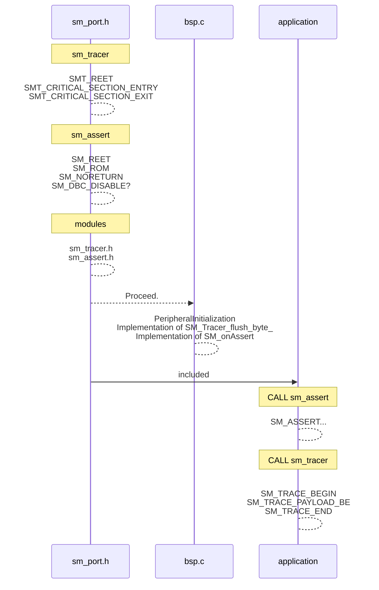

## SM_Tracer

```mermaid
sequenceDiagram
  participant PORT as sm_port.h
  participant BSP as bsp.c
  participant APP as application

  note over PORT: sm_tracer
  PORT --> PORT: SMT_REET<br/>SMT_CRITICAL_SECTION_ENTRY<br/>SMT_CRITICAL_SECTION_EXIT

  note over PORT: sm_assert
  PORT --> PORT: SM_REET<br/>SM_ROM<br/>SM_NORETURN<br/>SM_DBC_DISABLE?

  note over PORT: modules
  PORT --> PORT: sm_tracer.h<br/>sm_assert.h

  PORT -->> BSP: Proceed.
  BSP --> BSP: PeripheralInitialization<br/>Implementation of SM_Tracer_flush_byte_<br/>Implementation of SM_onAssert

  PORT ->> APP: included
  note over APP: CALL sm_assert
  APP --> APP: SM_ASSERT...
  note over APP: CALL sm_tracer
  APP --> APP: <br/>SM_TRACE_BEGIN<br/>SM_TRACE_PAYLOAD_BE<br/>SM_TRACE_END
```
